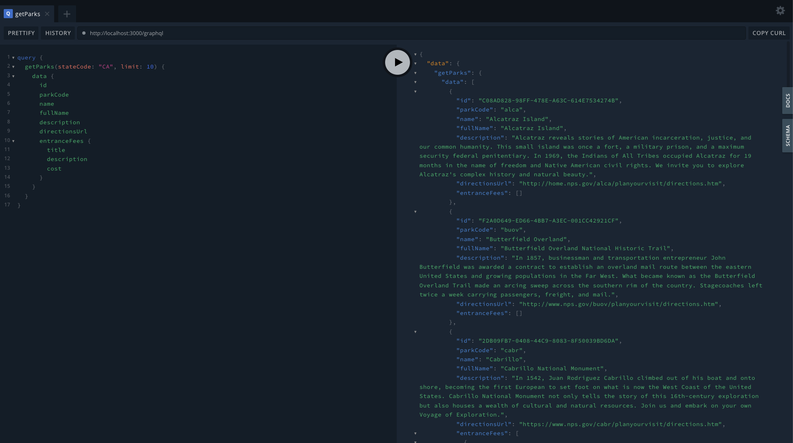

# NPS GraphQL API Adapter

## Description

This is a recreational programming project to implement a [NestJS](https://github.com/nestjs/nest) GraphQL API
adapter for the National Parks Service API.

## Notes on initial setup

The source tree was generated with:

```bash
alias nest='npx @nestjs/cli@11.0.2'
nest new nps_graphql
```

GraphQL dependencies were installed with:

```bash
npm i @nestjs/graphql @nestjs/apollo @apollo/server graphql
```

A new module, service, and resolver was added for NPS specific code:

```bash
npx nest g module nps
npx nest g service nps
npx nest g resolver nps
```

See [Nest GraphQL quick start](https://docs.nestjs.com/graphql/quick-start)).

## Compile and run the project

```bash
# development
$ npm run start

# watch mode
$ npm run start:dev

# production mode
$ npm run start:prod
```

You can then visit the GraphQL Playground in your browser:

<http://localhost:3000/graphql>



## Run tests

```bash
# unit tests
$ npm run test

# e2e tests
$ npm run test:e2e

# test coverage
$ npm run test:cov
```

## Deployment

When you're ready to deploy your NestJS application to production, there are some key steps you can take to ensure it runs as efficiently as possible. Check out the [deployment documentation](https://docs.nestjs.com/deployment) for more information.

If you are looking for a cloud-based platform to deploy your NestJS application, check out [Mau](https://mau.nestjs.com), our official platform for deploying NestJS applications on AWS. Mau makes deployment straightforward and fast, requiring just a few simple steps:

```bash
$ npm install -g mau
$ mau deploy
```

With Mau, you can deploy your application in just a few clicks, allowing you to focus on building features rather than managing infrastructure.

## License

[MIT licensed](https://github.com/nestjs/nest/blob/master/LICENSE).
